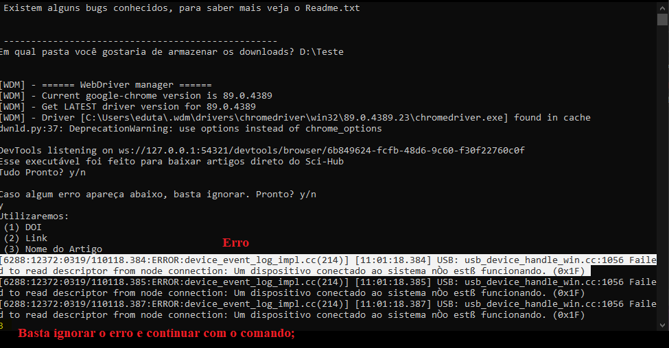

  
    <h3 align="center"> Sci-Hub Downloader </h3>
    

    

  Um pequeno Script para automatizar a busca e download de artigos no Sci-Hub.
     
   
  <a href="https://github.com/Ttytamaki/SciHub_Downloader/tree/main/Downloader.exe">Executável</a>
    ·
    <a href="https://github.com/Ttytamaki/SciHub_Downloader/tree/main/Script">Script</a>
  

<!-- TABLE OF CONTENTS -->

  
Conteúdo

  <ol>
    <li>
      <a href="#o-que-é">O que é</a>
    </li>
    <li>
      <a href="#como-usar">Como Usar</a>
    </li>
    <li><a href="#bugs-conhecidos">Bugs Conhecidos</a></li>
    <li><a href="#to-do"> To-Do</a></li>
  </ol>

 

******

  <bold> Atualmente, o Sci-Hub está com um problema para baixar artigos usando Links. Sugerimos priorizar a busca por DOI </bold>

  
  
## O que é:
Um pequeno código escrito em *python* que lhe permite automatizar download de artigos através do site Sci-Hub.
 
Você pode escolher por DOI, Link, ou até mesmo pelo nome dos artigos;
 

## Como usar:
1) **Baixe** o arquivo "*Sci-Hub Download.rar*"" e extraia ele para uma pasta do seu computador;
2) Abra o executável: *dwnld.exe*, na pasta *dist*;
3) O executável irá abrir uma janela do Chrome e, então, basta seguir os passos que aparecem;
4) Escolha qual pasta você vai querer usar como base (para armazenar os downloads);
5) Escolha agora se você quiser DOI, Link, ou o nome do artigo;
6) Caso dê o erro: 
"USB: usb_device_handle_win.cc:1049 Failed to read descriptor from node connection: Um dispositivo conectado ao sistema nÒo estß funcionando"
Basta ir para linha abaixo, logo após do aviso, e digitar: **y** ou **Y**, como mostra a foto abaixo:

  
    

    
6) Próximo passo é seguir o que o executável te indica;
7) Repita quantas vezes quiser e, quando quiser parar, basta inserir "**n**", "**N**";

## Bugs Conhecidos:
Há um erro conhecido na atual versão do bot:
"USB: usb_device_handle_win.cc:1049 Failed to read descriptor from node connection: Um dispositivo conectado ao sistema nÒo estß funcionando"  
Esse erro é um bug da atual versão do ChromeDrive;  
**Não se preocupe!** Caso aconteça, basta fazer o seguinte:
- Vá para a linha logo abaixo, a primeira abaixo do texto e digite: **y** ou **Y**;

**TL:DR**: Se aparecer algum erro do tipo:   
"[5016:6244:0325/220826.438:ERROR:ssl_client_socket_impl.cc(924)] handshake failed; returned -1, SSL error code 1, net_error -107"  
ou  
"USB: usb_device_handle_win.cc:1049 Failed to read descriptor from node connection: Um dispositivo conectado ao sistema nÒo estß funcionando"  
**Basta ignorar e continuar.** Esses são bugs conhecidos do ChromeDriver e, até o momento, não há uma solução para eles.

## To-do:

- [ ] Aprimorar Download pelo Sci-Hub
   - [ ] Listas de Links/DOIs/Nomes;
   - [x] Renomear Arquivos livremente (Almost rs)
- [ ] Expandir para Downloads pelo Libgen
- [ ] Criar uma interface (quem sabe, se o Mestrado deixar rs)

Para sugestões ou dicas, me envia um [e-mail](mailto:eduardo.rtamaki@gmail.com?subject=[GitHub]%20Source%20SciHub%20Dwnld) :)

 

 

